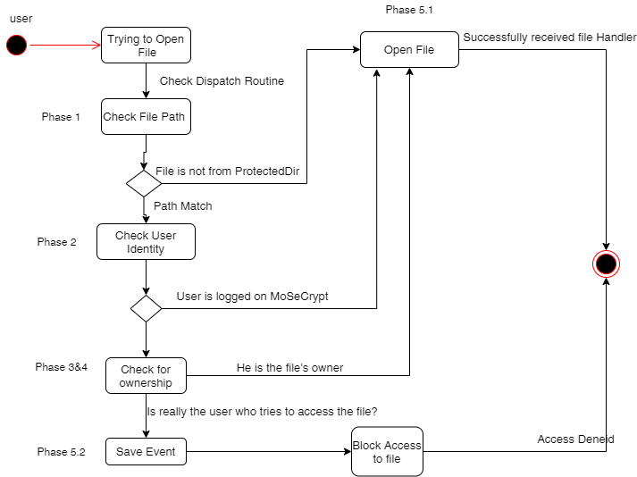
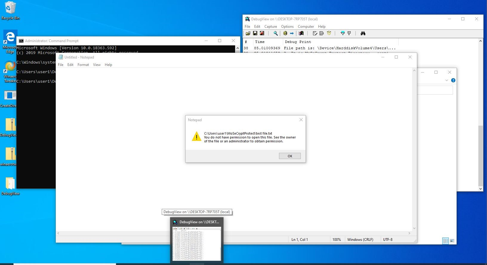
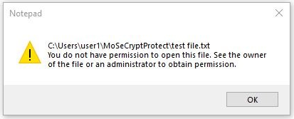

# Access Restriction MiniFilter Driver

## 1. About 
 This driver implements a method to monitor and secure access to files. It prevents other system users to read or write to a files located in a specific directory. Supposing `user1` has created a file called `file1` and `user2` whats to delete it or to change it, <b>the driver will not allowed</b> the second user or the other users, even if they have administrator rights, to access the file.

 ## 2. Research
 This project was created based on exemples provided by Pavel Yosifovich in his book `Windows Kernel Programming` [Book](https://leanpub.com/windowskernelprogramming). I extended a project solution called `DelProtect`, which block the delete operation in a specific, so that nobody can open or modify the file, except the owner of the file.  

 ## 3. Implementation
The aim of this driver was to prevent other users to access specific files. So that, the driver watches over a directory called `C:\Users\<username>\MoseCryptProtect\`, where `username` is the name of current logged user, and it a intercept the `IRP called by Callback IRP_MJ_CREATE flag`, verifying if the user how wants to access the file is actually the owner of the file.  
This verification consists in getting the file owner name based on path and comparring to current executing called. After that each username is conterting to its `SID`. 
 

## 4. Result

## 5. Configuration
<b>In order to install the driver please disable driver signature verification.</b>
 
After that, right click on `.inf` file and choose the `install` options. 
To start the driver execute de following command from an administrator cmd `fltmc load <drivername>`.

## 6. Other details

This driver is a part from another application developped to protect and secure access to file. 
 
<b>To allow access to files from that directory you could use the client application `DirProtectConfiguration.exe` which is the same client application implemented in book mentioned before. </b>

USAGE:  
Remove protection: `DirProtectConfiguration.exe add C:\Users\<username>\MoseCryptProtect`
Restore protection `DirProtectConfiguration.exe clear`